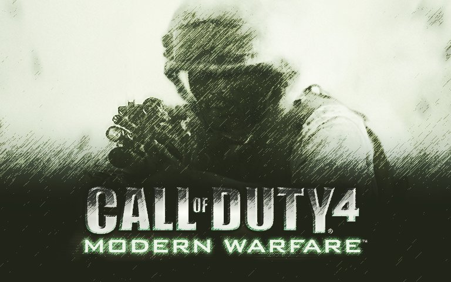

# COD4 Docker Dedicated Server



[](https://github.com/nooblk-98/cod4-docker/actions/workflows/release.yml)
[](https://github.com/nooblk-98/cod4-docker/releases)
[](https://hub.docker.com/r/lahiru98s/cod4)
[](https://hub.docker.com/r/lahiru98s/cod4)

Call of Duty 4: Modern Warfare dedicated server in a Docker image using the [CoD4X 21.2](https://github.com/callofduty4x/CoD4x_Server) community server fork.

## Pull the image

```bash
# Docker Hub
docker pull lahiru98s/cod4:21.2

# GitHub Container Registry
docker pull ghcr.io/nooblk-98/cod4-docker:21.2
```

## Requirements

- COD4 game client (version 1.7+)
- Original COD4 `main/` and `zone/` files from your game installation

## Quick start

### 1. Prepare directories

```bash
mkdir -p main zone mods usermaps logs
```

### 2. Copy game files

From your COD4 installation directory:

```bash
cp /path/to/cod4/main/*.iwd ./main/
cp /path/to/cod4/zone/*     ./zone/
```

Optional — mods and custom maps:

```bash
cp -r /path/to/cod4/mods/*     ./mods/
cp -r /path/to/cod4/usermaps/* ./usermaps/
```

### 3. Fix ownership

The container runs as user ID `1000` by default:

```bash
sudo chown -R 1000:1000 main zone mods usermaps logs
chmod -R 700 main zone mods usermaps
```

### 4. Run

```bash
docker run -d --name=cod4 \
  -p 28960:28960/tcp -p 28960:28960/udp -p 8000:8000/tcp \
  -v $(pwd)/main:/home/user/cod4/main \
  -v $(pwd)/zone:/home/user/cod4/zone \
  -v $(pwd)/mods:/home/user/cod4/mods \
  -v $(pwd)/usermaps:/home/user/cod4/usermaps:ro \
  -v $(pwd)/logs:/home/user/.callofduty4 \
  lahiru98s/cod4:21.2 +map mp_shipment
```

### Docker Compose

```yaml
services:
  cod4:
    image: lahiru98s/cod4:21.2
    container_name: cod4
    ports:
      - 28960:28960/udp
      - 28960:28960/tcp
      - 8000:8000/tcp
    volumes:
      - ./main:/home/user/cod4/main
      - ./zone:/home/user/cod4/zone
      - ./mods:/home/user/cod4/mods
      - ./usermaps:/home/user/cod4/usermaps:ro
      - ./logs:/home/user/.callofduty4
    environment:
      - HTTP_SERVER=on
      - ROOT_URL=/
    command: +set dedicated 2 +set sv_cheats 1 +set sv_maxclients 64 +exec server.cfg +map_rotate
    restart: always
```

```bash
docker compose up -d
```

## Environment variables

| Variable | Default | Description |
|---|---|---|
| `HTTP_SERVER` | `on` | Enable/disable the built-in HTTP file server on port `8000` |
| `ROOT_URL` | `/` | Root URL prefix for the HTTP server (useful behind a reverse proxy) |

## HTTP file server

The built-in HTTP server on port `8000` serves files from `mods/` and `usermaps/` so clients download custom content automatically on connect.

Configure `server.cfg` to point clients to it:

```
set sv_allowdownload "1"
set sv_wwwDownload "1"
set sv_wwwBaseURL "http://your-server-ip:8000"
set sv_wwwDlDisconnected "0"
```

- **Disable:** `-e HTTP_SERVER=off`
- **Change root URL:** `-e ROOT_URL=/cod4`
- Only `.ff` and `.iwd` extensions are served; all other requests return HTTP 403

## Mods

Place your mod in `./mods/mymod/` and add `+set fs_game mods/mymod` to the command:

```bash
+set dedicated 2 +set sv_cheats "1" +set sv_maxclients "64" +set fs_game mods/mymod +exec server.cfg +map_rotate
```

## Command-line only arguments

These cannot be set in `server.cfg` — pass them on the command line:

| Argument | Description |
|---|---|
| `+set dedicated 2` | `2` = public, `1` = LAN, `0` = local |
| `+set sv_cheats "1"` | Enable cheats |
| `+set sv_maxclients "64"` | Max player count |
| `+exec server.cfg` | Load config file |
| `+set fs_game mods/mymod` | Load a custom mod |
| `+map_rotate` / `+map <name>` | Must be the **last** argument |

## Build from source

```bash
docker build -t cod4 .
```

### Build arguments

| Argument | Default | Description |
|---|---|---|
| `UID` | `1000` | Container user ID |
| `GID` | `1000` | Container group ID |
| `COD4X_VERSION` | `21.2` | CoD4X server version |

## Testing

1. Launch COD4 multiplayer
2. **Join Game** → **Source** → *Favourites*
3. **New Favourite** → enter your server IP
4. **Refresh** and connect

## Acknowledgements

- [CoD4X Server](https://github.com/callofduty4x/CoD4x_Server) developers
